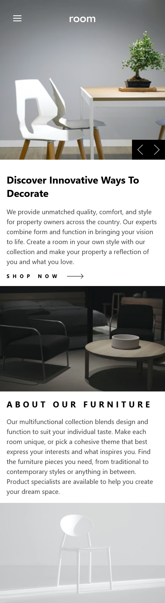
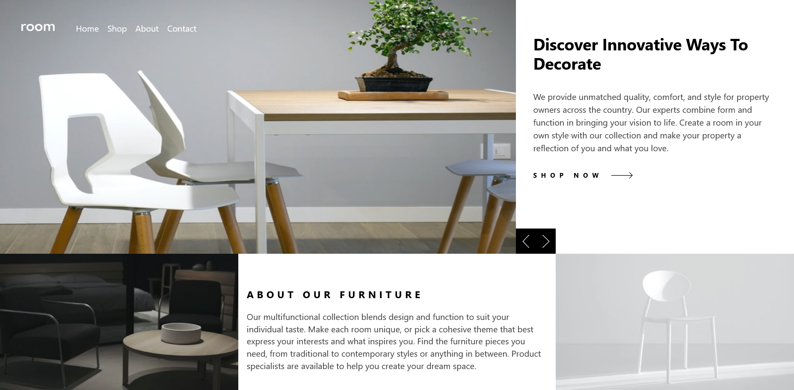

# Frontend Mentor - Room homepage solution

## Table of contents

- [Overview](#overview)
  - [Screenshot](#screenshot)
  - [Links](#links)
- [My process](#my-process)
  - [Built with](#built-with)
  - [What I learned](#what-i-learned)
  - [Continued development](#continued-development)
  - [Useful resources](#useful-resources)
- [Author](#author)

### Screenshot




### Links

- Solution URL: [Add solution URL here](https://github.com/bakryelzzubair/room-homePage-reactjs.git)
- Live Site URL: [Add live site URL here](https://room-home-page-reactjs.vercel.app/)

## My process

### Built with

- Semantic HTML5 markup
- CSS custom properties
- Flexbox
- CSS Grid
- Mobile-first workflow
- [React](https://reactjs.org/) - JS library
- [uuid](https://www.npmjs.com/package/uuid) - universally unique identifire library
- [tailwincss](https://tailwindcss.com/) - For styles

### What I learned

To see how you can add code snippets, see below:

```html
<picture>
  <source
    className="bg-contain lg:overflow-hidden"
    media="(min-width: 768px)"
    srcset="{assets[index].desktop}"
  />
  
</picture>
```

```css
@media (prefers-reduced-motion: reduce) {
    .navBtn:hover::after {
        color: black;
    }
}
```

```reactjs
  useEffect(() => {
    if (isOpen) {
      document.body.classList.add("overflow-y-hidden");
    } else {
      document.body.classList.remove("overflow-y-hidden");
    }

    () => {
      document.body.classList.remove("overflow-y-hidden");
    };
  }, [isOpen]);
```


### Continued development

i meat som issues in placing the slide galary buttons i will refactore this part of code after some time of practices

### Useful resources

- [tsbsankara youtub channle](https://www.youtube.com/@tsbsankara) - This helped me for designin the navigation for both desktop and mobile

## Author

- Website - [Abubakr Ahmed](https://bakryelzzubair.vercel.app/)
- Frontend Mentor - [@bakryelzzubair](https://www.frontendmentor.io/profile/bakryelzzubair/)
